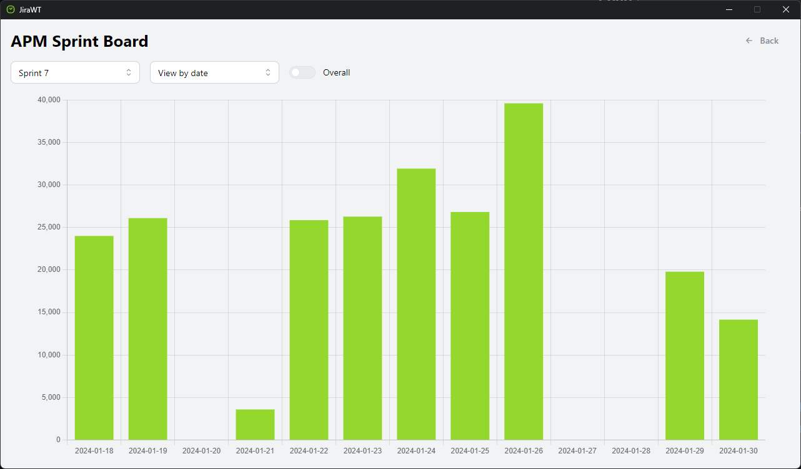
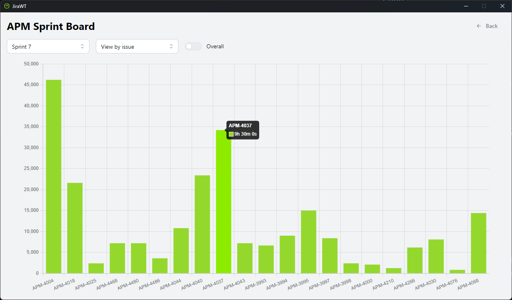
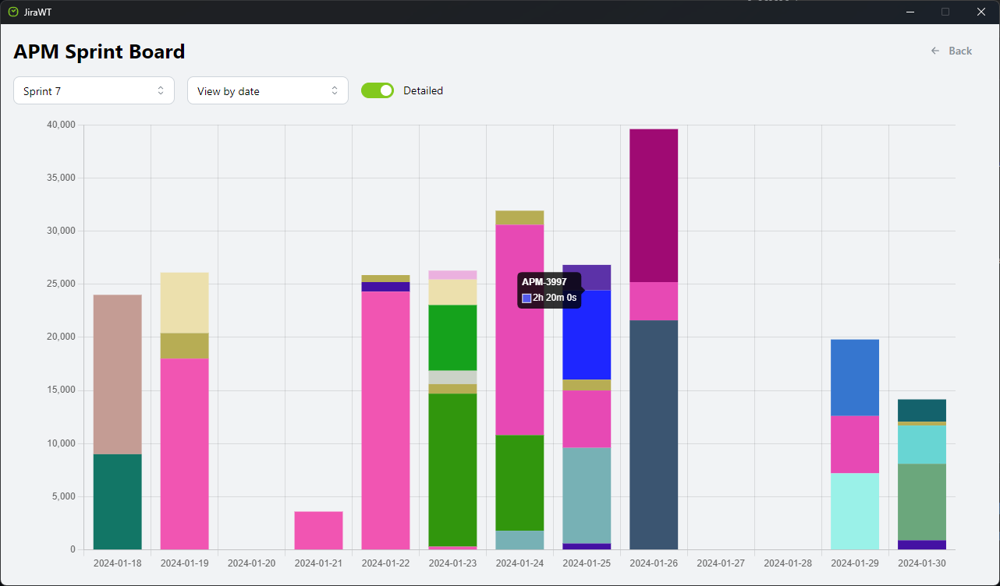

# JiraWT

A simple desktop app to track your worklogs in sprints.







## Requirements

- Rust
- Node.js
- Yarn

## How to run

```bash
# Install the Node.js dependencies
yarn
```

```bash
# Run the application
yarn tauri dev
```

```bash
# Build the application
yarn tauri build
```
